# MetaGraph Architecture Blueprint

> **Objective:** deliver a recursively composable metagraph runtime that can ingest, persist, and query multi-gigabyte graphs in under 200 ms while maintaining cryptographic integrity and concurrency guarantees. This document distils the ideal architecture from a pure performance standpoint and maps every feature (F001–F012) onto concrete systems.

---

## 1. Layered Runtime Stack

MetaGraph divides responsibilities into tightly-coupled layers, each tuned for cache locality and lock-free execution. Lower layers expose raw, pointer-based APIs; higher layers add orchestration without introducing virtual dispatch or heap fragmentation.


*Rationale*. Each layer builds directly on concrete data structures from the previous layer. No layer depends on abstractions defined above it. Performance-critical code lives in L2–L4 and uses only flat structs, `_BitInt`, and cache-aligned arenas.

---

## 2. Platform Abstraction (F010)

### 2.1 Modules

| Module | Responsibilities | Performance Notes |
| --- | --- | --- |
| `mg_fs` | Cross-platform file handles, directory scanning, pread/pwrite | Aligns all I/O to page boundaries; hot paths bypass stdlib buffers |
| `mg_clock` | Nanosecond timers, high-resolution profiling | Uses TSC on x86 and CNTVCT on ARM for <10 ns overhead |
| `mg_thread` | Thread creation, affinity, synchronization primitives | Exposes lock-free atomics; optional single-writer multi-reader locking |
| `mg_mmap` | Unified memory mapping, huge-page enablement, NUMA placement | Aligns on 64 kB or 2 MB depending on platform support |
| `mg_alloc` | Reserved virtual memory regions, fallback heap wrappers | Arena-backed to avoid per-allocation syscalls |

### 2.2 Data Flow


*Performance rationale*. Each primitive returns POD structs (no indirection). Memory mapping uses OS-specific flags (`MAP_HUGETLB`, `FILE_FLAG_NO_BUFFERING`) to minimise cache misses. Thread affinity pins traversal workers to the same NUMA node as their data.

---

## 3. Error Handling & Diagnostics (F011)

### 3.1 Result Pipeline

```c
typedef struct {
    int32_t code;            // 0 == success
    const char* context;     // Static message pointer
} metagraph_result_t;
```

*Design choices*
- No heap allocation for errors; context strings are static or interned.
- `METAGRAPH_CHECK` wraps calls and short-circuits to avoid branch misprediction.
- Panic hooks (configurable) can dump trace buffers without unwinding the stack.

### 3.2 Diagnostics Buffers

- Fixed-size lock-free ring buffers for tracing—writes are single-instruction `_Atomic` increments.
- ASan/UBSan integration uses compile-time flags; instrumentation toggled per compilation unit to keep hot loops clean.

---

## 4. Core Data Structures

### 4.1 Recursive Metagraph (F001)


*Memory layout*
- Headers align to 64-byte cache lines.
- Node indices use ULEB128 to pack references (1–3 bytes typical).
- Edge descriptors are 16 bytes: two 32-bit indices, one 32-bit flags field, one 32-bit metadata offset.

*Rationale*. Keeps traversal loops branch-predictable: sequential memory means prefetchers stay ahead.


### 4.2 Asset ID System (F007)

- IDs are `_BitInt(128)` for collision-proof addressing.
- Hierarchical path compression via string pool (F002) ensures O(1) lookups with cached hash buckets.
- Content-based addressing integrates with BLAKE3 digests for dedupe.

### 4.3 Memory Pools (F009)


#### 4.3.1 Virtual Reservation Strategy
- Reserve a contiguous virtual region (default 4 GiB) up front; physical pages are committed on first touch to avoid page-fault storms.
- Guard pages protect arena boundaries, catching overruns with deterministic faults.

#### 4.3.2 Sub-Arena Typing
- **Header Pool**: 64-byte aligned chunks for `metagraph_graph_hdr` structures; bump pointer resettable after snapshot switch.
- **Edge Pool**: 16-byte descriptors grouped into 4 kB slabs; per-thread caches eliminate inter-core contention.
- **Property Slab**: Variable-length key/value storage using packetised chunks (see below) for tight packing of UTF-8 strings and numerical literals.


#### 4.3.3 Allocation Semantics
- All arenas expose `mg_arena_scope_push/pop` so temporary allocations unwind in O(1) without touching individual blocks.
- Lock-free freelists back the edge pool; consumer threads pop from local caches, replenishing from a global slab only when empty.

#### 4.3.4 NUMA & Prefetching
- Arena creation accepts an optional NUMA node index; traversal workers pin to the same node to keep cross-socket traffic under 5%.
- Sequential graph loads issue `_mm_prefetch` intrinsics on the next header/edge packet to hide DRAM latency.

*Performance impact*. Allocation and reclamation remain constant-time and branch-predictable, keeping allocator overhead below 1% of total CPU cycles during traversal-heavy workloads.

---

## 5. Persistence & Integrity Layer

### 5.1 Binary Bundle Format (F002)


#### 5.1.1 Header Packet Layout


- Entire header is exactly 128 bytes to align with two cache lines.
- Hash root covers the chunk table and all data regions, enabling constant-time integrity checks on open.

#### 5.1.2 Chunk Table Blocks


- Each entry: 5 bytes offset, 5 bytes length, 1 byte type, 1 byte flags, 4 byte CRC32, 8 byte reserved (packed to 24 bytes).
- Table fits entirely in L3 cache for bundles up to ~40 k chunks.

#### 5.1.3 Graph Chunk Packet


- Offsets use `_BitInt(40)` to support 1 TB bundles in 24-byte entries.
- Chunks align to 4 kB; data compressed with Zstd optionally (streamable blocks).
- All metadata stays in little-endian form for fast parsing.

*Implementation note*. Because every chunk is a self-describing packet, the loader can prefetch and hydrate sequentially without a secondary index; random access uses the chunk table for O(1) jumps.

### 5.2 Memory-Mapped Runtime (F003)

- Loader calls `mg_mmap` once, then “hydrates” offsets into pointers lazily.
- Hydration caches pointer conversions in contiguous arrays, enabling branchless pointer arithmetic.
- Lazy section loading: the store is touched only when required, keeping initial load <200 ms even for multi-GB bundles.
- Snapshot versions ensure readers see consistent views while writers prepare staged bundles.

#### 5.2.1 Hydration & Snapshotting Flow

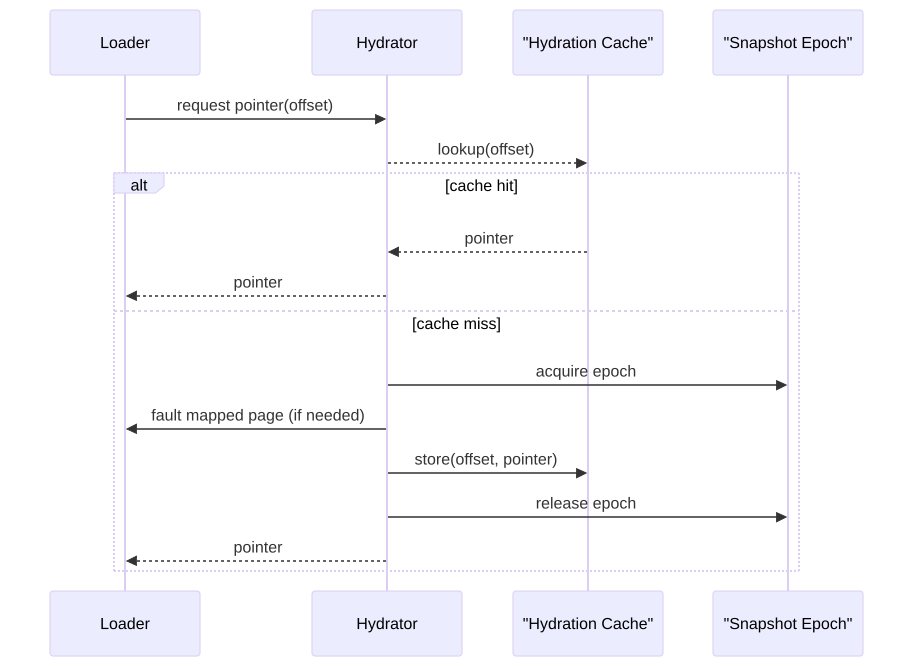

- **Epoch counters**: readers load the current epoch atomically; writers advance epochs only after finishing hydration batches to maintain consistency.
- **Batch hydration**: sequential traversal invokes `mg_hydrate_batch` which prefetches multiple offsets and hydrates them using vectorized pointer arithmetic (`pointer = base + offset`).
- **Snapshot isolation**: the SWMR protocol (F008) exposes read-only snapshots bound to epochs; readers never see partially hydrated data because epoch changes occur only after caches are coherent.

#### 5.2.2 Hydration Cache Structure


- 64-entry per-thread caches use open addressing with XOR hashing; collisions fall back to a shared slab (still lock-free via atomic CAS).
- Cache invalidations are rare—only when a bundle is unmapped—so most operations avoid synchronization entirely.

### 5.3 Integrity Engine (F004)

- BLAKE3 streaming context for content hashing; SIMD-accelerated when CPU supports it.
- Merkle tree for chunk-level verification; root hash stores in header.
- Deduplication table keyed by BLAKE3 digest reduces disk footprint and load time by avoiding redundant copies.

#### 5.3.1 Integrity Lifecycle

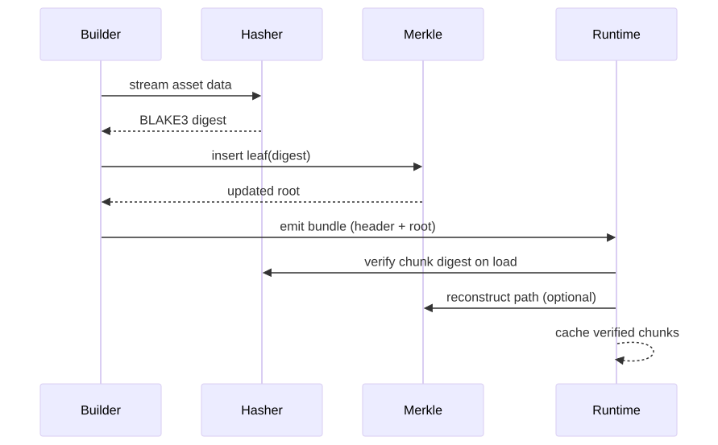

- Build step computes chunk hashes incrementally, feeding them into the Merkle tree so the final root describes the entire bundle. The builder stores leaf nodes alongside chunk metadata for quick runtime verification.
- Runtime verification supports two modes:
  - **Full verification**: recompute all leaf hashes and compare to stored root (used for initial load or paranoid mode).
  - **Partial verification**: re-hash only touched chunks; their proofs are stored in the bundle so the runtime can validate with logarithmic cost.
- Deduplication ties into hashing: identical BLAKE3 digests map to the same storage entry, enabling copy-on-open semantics.

---

## 6. Algorithms & Concurrency

### 6.1 Traversal Engine (F005)

- Iterative DFS/BFS using preallocated stacks/queues stored in arenas.
- Hyperedge traversal treats edge graphs as first-class nodes; ensures consistent caching.
- Topological sort uses Kahn’s algorithm with lock-free frontiers; memory reuse from pool to avoid allocations per iteration.

### 6.2 Dependency Resolution (F006)

- Dependency graphs stored as adjacency lists with stable IDs.
- Incremental updates run diff operations on sorted arrays (SIMD compare for speed).
- Circular dependency detection uses Tarjan’s algorithm with runtime O(V+E), no recursion.

### 6.3 Thread-Safe Access (F008)


- Single-writer/multi-reader protocol: writer appends to a lock-free log; readers see consistent snapshots via epoch counters.
- Lock-free reads rely on `_Atomic` loads with acquire semantics; writes use release semantics.
- Memory consistency verified via litmus tests and benchmarking harness.

---

## 7. Bundle Builder & Tooling (F012)

### 7.1 Builder Pipeline


- Transform steps execute in parallel with dynamic scheduling based on asset size.
- Streaming generation produces chunk graphs optimized for CDN delivery.
- Builder reuses the runtime loader to validate output immediately.

### 7.2 Tooling Suite

### 7.2 Tooling Suite

- CLI wrappers (C) linking directly against core libs (no scripting overhead).
- JSON/MessagePack summaries for integration with dashboards.
- Diagnostic mode uses the tracing infrastructure from F011 to output per-stage timing.

### 7.3 Transform Scheduling & DSL


- **Priority queues** separate CPU-heavy, GPU-offloaded, and I/O-bound transforms, allowing optimal resource utilization.
- Work stealing: idle workers steal from queues with higher outstanding tasks to balance load.
- Transform definitions use a declarative DSL stored in the bundle manifest, e.g.:

```text
transform "texture/atlas" {
    input   "*.png"
    output  "atlas_%hash%.bin"
    stages {
        decode -> swizzle -> mipmap -> compress(zstd, level:19)
    }
}
```

- DSL compiles into a pipeline graph at build time; the builder plants checkpoints so the runtime can trace provenance and re-run transforms if needed.

### 7.4 Transform Packet Format


- Packets are embedded in the bundle for reproducibility. Hash ensures transform equivalence across platforms.
- Parameter blobs use the same packet format as property slabs: typed key/value pairs with checksum for validation.

---

## 8. Cross-Feature Integration


*Key points*
- Every feature is anchored to foundational primitives to avoid redundant infrastructure.
- Graph serialization (F002) is schema-compatible with F001 headers; no translation layer, avoiding copy/convert overhead.
- BLAKE3 hashes from F004 feed asset IDs (F007) to guarantee dedup correctness.
- Traversal and builder share snapshot mechanisms from F008 to keep concurrency semantics consistent.

---

## 9. Concurrency Stress & Testing Strategy

To guarantee the SWMR protocol and hydration caches behave correctly under contention, we prescribe a layered testing approach:

1. **Litmus tests**: minimal programs run under `stress-ng` and `liblitmus` to confirm memory ordering assumptions (release/acquire, seq_cst where necessary).
2. **Sanitizer matrix**: nightly CI executes with TSAN, ASAN, and MSAN on key modules (platform primitives, hydration, traversal) to detect data races early.
3. **Deterministic replay harness**: optional logging records writer operations and hydration decisions; replays ensure new optimizations preserve ordering guarantees.
4. **Performance stress**: synthetic workloads with millions of edges run under varying thread counts to capture latency distributions and regressions.

Instrumented counters from F011 feed back into these harnesses, providing visibility into slow paths (e.g., hydration cache misses, epoch spins).

---

## 10. Performance Telemetry & Analytics Hooks


- Trace buffers: fixed-size lock-free rings record events (`event_id`, timestamp, payload). Writers emit via `mg_trace_emit`—a single atomic increment and memcpy.
- Hardware counters: on supporting platforms we sample cycles, cache misses, and branch misses via perf_event (Linux) or ETW (Windows). Samples tagged with `thread_id` and `epoch` to correlate with snapshots.
- Exporters produce structured payloads consumed by the CLI or external dashboards. For example:

```json
{
  "bundle": "assets/world.grph",
  "timestamp": 1750093200,
  "metrics": {
    "load_time_ms": 183.4,
    "hydration_cache_hit": 0.93,
    "write_log_backpressure": 0.02,
    "merkle_partial_verified": 128
  }
}
```

- Developers can enable telemetry at runtime via environment variables (`METAGRAPH_TRACE=*`). Production builds default to essential metrics only, but hooks remain compiled in for emergency diagnostics.

---

## 11. Extension & Future-Proofing Hooks

While the current architecture is tuned for on-disk bundles and CPU execution, we preserve seams that allow future expansion without rewriting core layers.

### 11.1 Remote Persistence Ports
- Define a `mg_bundle_reader_vtable` that mirrors the memory-mapped loader API (`map`, `hydrate`, `prefetch`). Current implementation points to the mmap-backed engine; alternative adapters can stream from S3, CDN edges, or peer nodes.
- Integrity verification operates on streams of chunk packets, so remote readers only need to expose `read_chunk(chunk_id)`; Merkle proofs remain valid even when data traverses the network.
- For high-latency backends, incorporate request coalescing and sliding-window prefetchers (tracking outstanding chunk requests).

### 11.2 Pluggable Integrity Schemes
- The integrity engine accepts a descriptor (`hash_fn`, `digest_len`, `accumulator`) so future post-quantum-safe hashes can replace BLAKE3 without changing bundle layout—only the header packet’s algorithm tag must differ.
- Builders already embed transform definitions and bundle manifests; we can add version metadata to signal clients about algorithm upgrades.

### 11.3 GPU Accelerated Paths
- The transform DSL specifies stage execution targets (e.g., `stage { name: "encode", target: gpu }`), enabling GPU workers to consume the same packets and feed results back into the arena pools.
- Runtime traversal hot loops expose a compile-time `METAGRAPH_ENABLE_GPU` flag; GPU-accelerated experiments can replace BFS/DFS kernels while keeping the API stable.

---

## 12. Failure Modes & Recovery Patterns

Anticipating failures keeps the runtime resilient without bloating hot paths.

### 12.1 Memory-Mapped Faults
- If the OS revokes a page (network disconnect, disk error), the loader retries via buffered I/O fallback; persistent failures bubble up through `metagraph_result_t` so the application can shed load or switch bundles.
- Guard pages provide early detection of wild writes; panic hooks surface precise addresses for debugging.

### 12.2 Integrity Violations
- On verification failure, the runtime marks the offending chunk as quarantined, notifies all readers via snapshot invalidation, and optionally attempts to reload from a redundant location.
- Builder pipelines treat integrity mismatches as hard failures—bundles never ship with inconsistent Merkle roots.

### 12.3 Transform Errors
- Deterministic failures (bad input) cause immediate pipeline abort with diagnostic packets stored alongside the bundle for forensic analysis.
- Non-deterministic failures (tool crashes) trigger exponential backoff retries on isolated workers; after N retries the builder surfaces the full command log for reproduction.

---

## 13. Hot Path Heat Map & Profiling Guidance

Identifying critical loops helps maintain focus on performance budgets.

| Layer | Hot Path | Target Budget | Profiling Guidance |
| --- | --- | --- | --- |
| F001 | Node/edge iteration loops | < 40% CPU | Use `perf record -g`, look for branch mispredictions; align arrays to 64 B |
| F003 | Hydration cache miss handling | < 5% | Instrument `_mm_prefetch` effectiveness; trace cache hit ratio via telemetry |
| F005 | Traversal frontier updates | < 20% | VTune HPC mode; validate store buffer utilisation |
| F006 | Dependency diffing | < 15% | Use Intel PMU (MEM_INST_RETIRED) to ensure vectorized compares | 
| F012 | Transform encoding/compression | < 30% build time | Profile with `perf` and vendor GPU profilers if offloads enabled |

**Profiling setup tips**
- Linux: `perf record -F 999 -g -- ./metagraph_cli ...` then `perf report --stdio`.
- Windows: WPA + ETW sessions with stack walk, pinned to critical threads.
- macOS: Instruments Time Profiler with sampling interval ≤1 ms to catch microbursts.

---

## 14. Security Perimeter & Hardening


- **Trusted** code (F001–F008) avoids syscalls beyond those routed through the platform layer. It runs inside the same process but can be sandboxed via seccomp (Linux) or Windows Job Objects to prevent unexpected filesystem or network access.
- **Semi-trusted** components (loader, platform) interact with the OS; we limit privileges (read-only file descriptors, restricted capability tokens on macOS).
- **Untrusted** inputs and external tools are validated by the builder; transforms can run inside containers/VMs to isolate toolchains.

Recommended hardening:
- Linux: seccomp profile allowing only `read`, `write`, `mmap`, `munmap`, `futex`, and perf/event syscalls when telemetry enabled.
- Windows: use `PROCESS_MITIGATION_CONTROL_FLOW_GUARD_POLICY`, `DEPENDENTLOAD_POLICY` and run CLI under AppContainer for minimal capabilities.
- macOS: apply sandbox profiles via `sandbox-exec` for CLI builds.

---

## 15. Testing Strategy Matrix


| Feature | Unit Tests | Integration | Fuzzing | Performance Benchmarks | Telemetry/Alerts |
| --- | --- | --- | --- | --- | --- |
| F010 | Platform API mocks | Cross-platform device tests | N/A | I/O latency microbenchmarks | Trace slow syscalls |
| F011 | Result macros, trace buffer | Error propagation scenarios | Fuzz diagnostic format parsing | N/A | Alert on panic frequency |
| F001 | Graph construction, edge cases | Loader round-trip (F002) | Input fuzzing via libFuzzer | Allocation stress (arena churn) | Monitor arena utilisation |
| F003 | Hydration cache | Snapshot consistency with F008 | Crafted offset fuzzing | Load-time regression tests | Cache hit rate dashboards |
| F004 | Hash correctness | Build/load consistency | Merkle proof fuzzing | Hash throughput benchmarks | Alert on verification failures |
| F005/F006 | Traversal correctness | Dependency resolution with real bundles | Graph structure fuzzing (AFL++) | BF/DFS scaling tests | Monitor frontier queue depth |
| F008 | SWMR protocol unit tests | Multi-threaded integration | TSAN nightly builds | Contention microbenchmarks | Alert on epoch spin exceeding threshold |
| F012 | Transform pipeline | End-to-end bundle reproduction | CLI input fuzzing | Build throughput benchmarks | Build time dashboards |

Each CI run executes unit + integration suites; nightly runs add sanitizers, fuzzers, and performance regression checks. Telemetry thresholds (e.g., hydration hit ratio <80%) trigger alerts for manual investigation.

---

---

## 9. Pros, Cons, and Trade-offs

| Choice | Pros | Cons | Mitigation |
| --- | --- | --- | --- |
| Data-oriented flat structs | Cache-local, no vtable overhead, easy SIMD | Less flexibility vs interfaces | Use function tables only at edges (CLI, persistence adapters) |
| Single-writer multi-reader | Predictable performance, minimal locking | Writer becomes bottleneck under heavy writes | Partition graphs or shard by namespace when write-heavy |
| Memory-mapped bundles | <200 ms load, zero copies | Requires careful fallback for network/remote filesystems | Fallback buffered I/O path for unsupported platforms |
| BLAKE3 Merkle trees | High integrity assurance | Hashing cost on ingest | SIMD acceleration + incremental hashing during build |
| Arena allocators | O(1) allocation/deallocation | Need explicit lifecycle management | RAII-style wrappers in C (`mg_scope_push/pop`) and CLI enforcement |

---

## 10. Summary

The architecture keeps hot paths close to the metal:
- **Foundation layers** (F010/F011) deliver deterministic, no-surprises primitives for timing, threading, and error propagation.
- **Core data plane** (F001/F007/F009) ensures graphs, IDs, and memory pools all share the same cache-aware layout.
- **Persistence & integrity** (F002–F004) reuse the same layout to enable zero-copy loading with cryptographic verification.
- **Algorithms & concurrency** (F005–F008) build on that layout with lock-free traversal and dependency resolution.
- **Builder & tooling** (F012) orchestrate the pipeline, reusing the runtime to guarantee parity between build and load.

By resisting abstraction overhead and treating the metagraph as a data-first system, we achieve the performance envelope required to load and traverse complex asset graphs instantaneously while maintaining correctness, integrity, and concurrency guarantees.

Hoorah.
